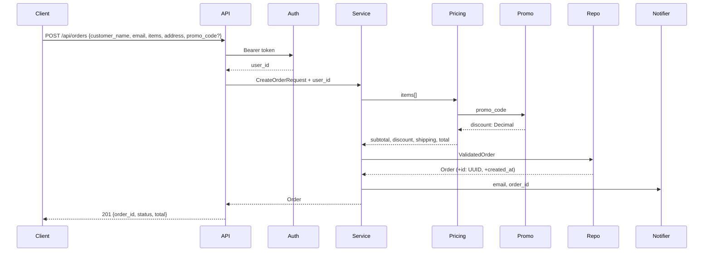

# Documentation-First Development

The agent MUST NOT jump straight to implementation. Every task flows: **understand → document → get approval → implement → update docs.**

## Ask Before You Act

If ANY of these are unclear, ask the user BEFORE writing code: exact scope, I/O types/format, which files will be touched, what "done" looks like (verification criteria), priority relative to other work. Do not assume. Do not guess.

## Spec Before Code

Before writing implementation, write a spec to `docs/specs/YYYY-MM-DD-<topic>.md`. Present to user for approval if non-trivial.

```markdown
# <Feature/Task Name>

## What
[2-3 sentences from user perspective]

## Scope
- In: [what's included]
- Out: [what's excluded]

## Input/Output
- Input: [types, fields, validation]
- Output: [types, fields, meaning]

## Design
[Classes/functions to create/modify, data flow, dependencies]

## Files to Touch
- [path/file.py] — [what changes, why]

## Verification
- [specific command that proves this works]

## Dependencies
- [other features, services, decisions]
```

## Business Logic Documentation

Business rules MUST live in version-controlled .md files, not just in code or conversation memory.

**Where:** `docs/business/<domain>.md` or `src/<module>/README.md`

**What to record:** What the rule is (plain language), why it exists, where implemented (file:line), when added/changed (date + commit).

```markdown
# Pricing Rules

## Free shipping over $50
- Rule: Orders ≥ $50 get free standard shipping
- Reason: Marketing promotion, effective 2024-01-01
- Implemented: src/orders/pricing.py:45 (calculate_shipping)
- Last updated: 2024-03-15 (abc1234)
```

## After Implementation

When a feature is complete and verified:
1. Update the spec with what ACTUALLY happened
2. Update business logic docs if rules changed
3. Update `docs/codebase-map.md` with new/changed files
4. Update `docs/GRAPH.md` with new code flow paths (see below)
5. Update `PROGRESS.md`
6. Update `AGENTS.md` if new conventions emerged

## Code Flow Graph (GRAPH.md)

Saved at `docs/GRAPH.md`. This is the living map of how code actually flows through the system — the call graph, data flow, and business logic flow combined. Agents read this BEFORE implementing to understand the system. Agents update it AFTER implementing to keep context from being lost across sessions.

### Purpose

- **Before implementing:** Read GRAPH.md to understand the end-to-end flow — what gets called in what order, where data transforms, which branches exist
- **After implementing:** Update GRAPH.md with new paths, new branches, changed flows
- **Context continuity:** When a session ends, the next session reads GRAPH.md and immediately understands how things connect — no re-discovery needed

### Template

```markdown
# Code Flow Graph
Last updated: <YYYY-MM-DD> by <session>

## Entry Points
[What triggers the system — HTTP endpoints, message consumers, cron jobs, CLI commands]
- POST /api/orders — Create a new order
- GET /api/orders/{id} — Get order by ID
- order.created (RabbitMQ) — Order created event consumer

## Order Creation Flow

### Visual Overview (Mermaid)


### Data Fields Detail
```
POST /api/orders
  → api/orders.py:create_order()
    IN:  CreateOrderRequest {customer_name: str, email: EmailStr, items: [{book_id: str, quantity: int}], shipping_address: Address {street, city, state, zip}, promo_code: str | None}
    OUT: 201 OrderResult {order_id: str, status: "confirmed", total: str}
         422 {"detail": [{"loc": [...], "msg": "..."}]}
         400 {"error": "promo_expired", "code": "SUMMER20"}

    → middleware/auth.py:require_auth(token)
      IN:  Bearer token from Authorization header
      OUT: user_id: str (added to request context)

    → services/order_service.py:create(request, user_id)
      IN:  CreateOrderRequest + user_id: str
      ADDS:    id: str (uuid4), status: OrderStatus.CONFIRMED, created_at: datetime (now)
      COMPUTES: subtotal: Decimal (sum of item prices × quantities)
                discount: Decimal (from promo service)
                shipping: Decimal (from shipping rules)
                total: Decimal (subtotal - discount + shipping)
      PASSES:   ValidatedOrder {id, customer_name, email, items[{book_id, quantity, unit_price}], address, subtotal, discount, shipping, total, status, created_at}

      → services/pricing.py:calculate(items)
        IN:  items: [{book_id: str, quantity: int}]
        DOES: looks up unit_price per book_id, computes subtotal
        OUT: subtotal: Decimal, items_with_prices: [{book_id, quantity, unit_price}]

      → services/promo.py:apply(code, subtotal)
        IN:  code: str | None, subtotal: Decimal
        DOES: validates code against business rules → docs/business/pricing.md
        OUT: discount: Decimal (0.0 if no code or invalid)

      → repositories/order_repo.py:save(order)
        IN:  ValidatedOrder
        STORES: orders(id, customer_name, email, subtotal, discount, shipping, total, status, created_at)
                order_items(order_id, book_id, quantity, unit_price)
        OUT: Order (same fields, confirmed persisted)

      → services/notification.py:send(email, order_id)
        IN:  email: str, order_id: str
        DOES: sends confirmation email via SendGrid (best-effort, failure logged as WARNING)
        OUT: None (fire-and-forget)

    → api/orders.py:_to_response(order)
      IN:  Order
      MAPS: Order.id → OrderResult.order_id, Order.status → OrderResult.status, Order.total → str
      OUT: OrderResult {order_id: str, status: str, total: str}
```

## Key Decision Points
[Where does the code branch? What conditions matter?]
- **Promo code validation** (services/promo.py:45)
  - Valid code → apply discount, continue
  - Expired code → raise PromoExpired (caught by API layer, returns 400)
  - Usage limit exceeded → raise PromoExhausted (caught by API layer, returns 400)

- **Shipping calculation** (services/pricing.py:78)
  - Domestic (US) → standard rates from shipping table
  - International → weight-based calculation
  - Free shipping → if subtotal >= $50 AND domestic
  - See: docs/business/pricing.md for complete rules

## Data Transformations

[CRITICAL: Show the ACTUAL FIELDS that flow through each layer. Agents must see what data is available at each step — not just type names. Use the format `TypeName {field1: Type, field2: Type}` to make data shape explicit.]

```
POST /api/orders HTTP Body (JSON)
  → CreateOrderRequest {customer_name: str, email: EmailStr, items: list[OrderItemRequest {book_id: str, quantity: int}], shipping_address: Address {street: str, city: str, state: str, zip: str}, promo_code: str | None}
    → ValidatedOrder {id: str, customer_name: str, email: str, items: list[OrderItem {book_id: str, quantity: int, unit_price: Decimal}], shipping_address: Address, subtotal: Decimal, discount: Decimal, shipping: Decimal, total: Decimal, status: OrderStatus, created_at: datetime}
      → Order (ORM) {id: UUID, customer_name: str, email: str, subtotal: Decimal, discount: Decimal, shipping: Decimal, total: Decimal, status: OrderStatus, created_at: datetime}  [items stored in order_items table]
        → OrderResult {order_id: str, status: OrderStatus, total: str, tracking_number: str | None}
          → HTTP 201 JSON Body

Field map:
- CreateOrderRequest.customer_name → ValidatedOrder.customer_name → Order.customer_name → OrderResult has NO customer_name (not exposed in result)
- CreateOrderRequest.items[*].book_id → OrderItem.book_id (after price lookup adds unit_price)
- subtotal/discount/shipping/total: COMPUTED in services/pricing.py, NOT in the request
- status: CREATED by service layer (OrderStatus.CONFIRMED after validation)
- id: GENERATED by service layer (uuid4)
```

## External Calls
[What leaves the process? Databases, APIs, message queues, file system]
- **PostgreSQL** — order persistence, inventory check (repositories/order_repo.py, repositories/inventory_repo.py)
- **Redis** — rate limiting on promo code usage (services/promo.py:30)
- **SendGrid** — order confirmation email (services/notification.py:25)
- **RabbitMQ** — publish order.created event after successful save (services/order_service.py:67)
- **AWS S3** — invoice PDF storage (services/invoice.py:40)

## Error Propagation
[What errors can occur and how do they flow to the user?]
- ValidationError (Pydantic) → caught by FastAPI → 422 with {"detail": [{"loc": ["body","email"], "msg": "value is not a valid email"}]}
- OrderNotFound (domain) → caught by API layer → 404 with {"error": "order_not_found", "order_id": "xxx"}
- PromoExpired (domain) → caught by API layer → 400 with {"error": "promo_expired", "code": "SUMMER20"}
- DatabaseError → caught by repository → wrapped as PersistenceError → caught by service → logged → 500 with {"error": "internal_error"}
- SendGrid timeout → caught by notification service → logged as WARNING → order still succeeds (notification is best-effort)
```

### Rules for GRAPH.md

1. **Read BEFORE implementing.** If you don't understand the flow, you'll break it.
2. **Update AFTER implementing.** Every new endpoint, every new branch, every new external call — add it to the graph.
3. **Dual format for every flow:** Mermaid sequence diagram (visual overview) + arrow-text with IN/OUT/ADDS/COMPUTES/STORES (field-level detail agents parse).
4. **IN/OUT on every step.** Show exactly what fields enter and exit each function. Mark computed fields (COMPUTES), generated fields (ADDS), and stored schema (STORES).
5. **Show exact error response shapes** — not just "404" but the actual JSON body `{"error": "order_not_found", "order_id": "xxx"}`.
6. **One flow per use case.** Separate sections for create, read, update, delete with their own Mermaid + data detail.
7. **Keep it current.** A stale flow graph is worse than no flow graph — it lies to the agent.
3. **Use the arrow format consistently.** `caller → callee [description]` — agents can parse this.
4. **Include business logic references.** Link to `docs/business/` files where rules are documented.
5. **Keep it current.** A stale flow graph is worse than no flow graph — it lies to the agent.
6. **One flow per major use case.** Don't mush everything together. Create separate flow sections for create, read, update, delete, search, etc.
