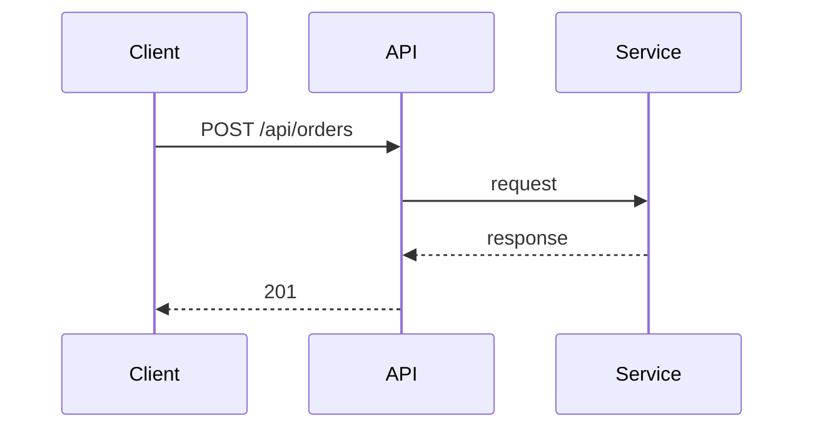

# Documentation-First Development

The agent MUST NOT jump straight to implementation. Every task flows: **understand → document → get approval → implement → update docs.**

## Ask Before You Act

If ANY of these are unclear, ask the user BEFORE writing code: exact scope, I/O types/format, which files will be touched, what "done" looks like (verification criteria), priority relative to other work. Do not assume. Do not guess.

## Spec Before Code

Before writing implementation, write a spec to `docs/specs/YYYY-MM-DD-<topic>.md`. Present to user for approval if non-trivial.

```markdown
# <Feature/Task Name>

## What
[2-3 sentences from user perspective]

## Scope
- In: [what's included]
- Out: [what's excluded]

## Input/Output
- Input: [types, fields, validation]
- Output: [types, fields, meaning]

## Design
[Classes/functions to create/modify, data flow, dependencies]

## Files to Touch
- [path/file.py] — [what changes, why]

## Verification
- [specific command that proves this works]

## Dependencies
- [other features, services, decisions]
```

## Business Logic Documentation

Business rules MUST live in version-controlled .md files, not just in code or conversation memory.

**Where:** `docs/business/<domain>.md` or `src/<module>/README.md`

**What to record:** What the rule is (plain language), why it exists, where implemented (file:line), when added/changed (date + commit).

```markdown
# Pricing Rules

## Free shipping over $50
- Rule: Orders ≥ $50 get free standard shipping
- Reason: Marketing promotion, effective 2024-01-01
- Implemented: src/orders/pricing.py:45 (calculate_shipping)
- Last updated: 2024-03-15 (abc1234)
```

## After Implementation

When a feature is complete and verified:
1. Update the spec with what ACTUALLY happened
2. Update business logic docs if rules changed
3. Update `docs/codebase-map.md` with new/changed files
4. Update `docs/GRAPH.md` with new code flow paths (see below)
5. Update `PROGRESS.md`
6. Update `AGENTS.md` if new conventions emerged

## Code Flow Graph (GRAPH.md)

Saved at `docs/GRAPH.md`. This is the living map of how code actually flows through the system — the call graph, data flow, and business logic flow combined. Agents read this BEFORE implementing to understand the system. Agents update it AFTER implementing to keep context from being lost across sessions.

### Purpose

- **Before implementing:** Read GRAPH.md to understand the end-to-end flow — what gets called in what order, where data transforms, which branches exist
- **After implementing:** Update GRAPH.md with new paths, new branches, changed flows
- **Context continuity:** When a session ends, the next session reads GRAPH.md and immediately understands how things connect — no re-discovery needed

### Template

```markdown
# Code Flow Graph
Last updated: <YYYY-MM-DD>

## Entry Points
- POST /api/orders — Create a new order

## Order Creation Flow

### Visual Overview (Mermaid)


### Data Fields Detail
```
POST /api/orders
  → api/orders.py:handler()
    IN:  RequestType {field: Type, ...}
    OUT: ResponseType {field: Type, ...}
```
[One example entry per section — show the format, not the full story]

## Key Decision Points
- Promo code validation (services/promo.py:45): valid → apply, expired → 400

## Data Transformations
[One example showing IN/ADDS/COMPUTES/OUT format]

## Error Propagation
- ValidationError → 422, OrderNotFound → 404
```

### Rules for GRAPH.md

1. **Read BEFORE implementing.** If you don't understand the flow, you'll break it.
2. **Update AFTER implementing.** Every new endpoint, every new branch, every new external call — add it to the graph.
3. **Dual format for every flow.** Mermaid sequence diagram (visual overview) + arrow-text with IN/OUT/ADDS/COMPUTES/STORES (field-level detail agents parse).
4. **IN/OUT on every step.** Show exactly what fields enter and exit each function. Mark computed fields (COMPUTES), generated fields (ADDS), and stored schema (STORES).
5. **Show exact error response shapes** — not just "404" but the actual JSON body `{"error": "order_not_found", "order_id": "xxx"}`.
6. **One flow per use case.** Create separate flow sections for create, read, update, delete, search, etc., each with their own Mermaid + data detail.
7. **Keep it current.** A stale flow graph is worse than no flow graph — it lies to the agent.
8. **Use the arrow format consistently.** `caller → callee [description]` — agents can parse this.
9. **Include business logic references.** Link to `docs/business/` files where rules are documented.
