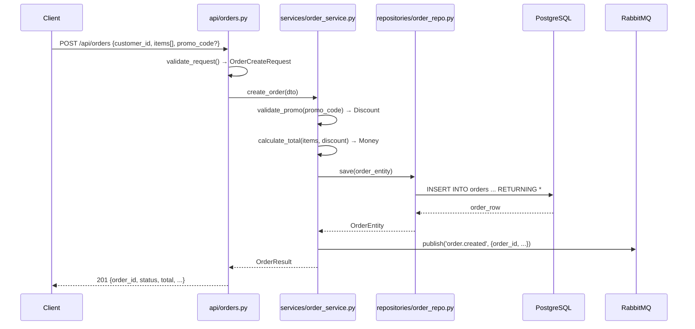

# Documentation-First Development

The agent MUST NOT jump straight to implementation. Every task flows: **understand → document → get approval → implement → update docs.**

## Ask Before You Act

If ANY of these are unclear, ask the user BEFORE writing code: exact scope, I/O types/format, which files will be touched, what "done" looks like (verification criteria), priority relative to other work. Do not assume. Do not guess.

## Spec Before Code

Before writing implementation, write a spec to `docs/specs/YYYY-MM-DD-<topic>.md`. Present to user for approval if non-trivial.

```markdown
# <Feature/Task Name>

## What
[2-3 sentences from user perspective]

## Scope
- In: [what's included]
- Out: [what's excluded]

## Input/Output
- Input: [types, fields, validation]
- Output: [types, fields, meaning]

## Design
[Classes/functions to create/modify, data flow, dependencies]

## Files to Touch
- [path/file.py] — [what changes, why]

## Verification
- [specific command that proves this works]

## Dependencies
- [other features, services, decisions]
```

## Business Logic Documentation

Business rules MUST live in version-controlled .md files, not just in code or conversation memory.

**Where:** `docs/business/<domain>.md` or `src/<module>/README.md`

**What to record:** What the rule is (plain language), why it exists, where implemented (file:line), when added/changed (date + commit).

```markdown
# Pricing Rules

## Free shipping over $50
- Rule: Orders ≥ $50 get free standard shipping
- Reason: Marketing promotion, effective 2024-01-01
- Implemented: src/orders/pricing.py:45 (calculate_shipping)
- Last updated: 2024-03-15 (abc1234)
```

## After Implementation

When a feature is complete and verified:
1. Update the spec with what ACTUALLY happened
2. Update business logic docs if rules changed
3. Update `docs/codebase-map.md` with new/changed files
4. Update `docs/GRAPH.md` with new code flow paths (see below)
5. Update `PROGRESS.md`
6. Update `AGENTS.md` if new conventions emerged

## Code Flow Graph (GRAPH.md)

Saved at `docs/GRAPH.md`. This is the living map of how code actually flows through the system — the call graph, data flow, and business logic flow combined. Agents read this BEFORE implementing to understand the system. Agents update it AFTER implementing to keep context from being lost across sessions.

**Quality bar: A fresh agent reading ONLY GRAPH.md must be able to trace any user action through every layer of the system, know every data field at every step, understand every branch and error path, and implement a feature touching any flow — without reading source code.**

### Purpose

- **Before implementing:** Read GRAPH.md to understand the end-to-end flow — what gets called in what order, where data transforms, which branches exist
- **After implementing:** Update GRAPH.md with new paths, new branches, changed flows
- **Context continuity:** When a session ends, the next session reads GRAPH.md and immediately understands how things connect — no re-discovery needed

### What GRAPH.md Must Contain — Completeness Checklist

**This is NOT a template with placeholders. This is a mandatory completeness standard. Every section must be fully populated with real project data.** When creating or updating GRAPH.md, work through this checklist exhaustively:

```
GRAPH.md Completeness Checklist:
- [ ] Every entry point documented (API endpoints, CLI commands, event handlers, cron jobs, queue consumers)
- [ ] For each entry point: full flow through ALL layers (controller → service → repository → external services)
- [ ] For each step in each flow: IN fields (name + type), OUT fields (name + type), ADDS fields (generated), COMPUTES fields (derived), STORES (schema + table/collection)
- [ ] Every branch/condition documented (what triggers each path, what happens on each path)
- [ ] Every error response documented with exact JSON shape and HTTP status
- [ ] Every external dependency documented (DB queries with SQL, API calls with URL + payload, queue messages with schema)
- [ ] Business rules linked at the exact point they're applied (→ docs/business/<domain>.md)
- [ ] Every file referenced with line numbers: `src/module/file.py:123` (function_name)
- [ ] Mermaid sequence diagram for EVERY flow (not just one example)
- [ ] Data transformations shown as pipeline steps: IN → ADDS → COMPUTES → STORES → OUT
```

### Detailed Template — Fill EVERY Section Completely

Do NOT copy this template as-is with placeholders. Replace EVERY placeholder with real data discovered by reading the actual source code. Delete no sections. Leave no `[...]` or `<...>` behind.

```markdown
# Code Flow Graph
Last updated: <YYYY-MM-DD>
Codebase version: <git describe --tags or commit hash>

## Entry Points

List EVERY way the system receives external input. For each: HTTP method + path, CLI command, event handler name, cron schedule, queue name.

### HTTP API
| Method | Path | Handler | File:Line | Description |
|--------|------|---------|-----------|-------------|
| POST | /api/orders | create_order | src/api/orders.py:42 | Create a new order |
| GET | /api/orders | list_orders | src/api/orders.py:89 | List orders with filters |
| GET | /api/orders/{id} | get_order | src/api/orders.py:130 | Get single order by ID |

### CLI Commands
| Command | Handler | File:Line | Description |
|---------|---------|-----------|-------------|
| python -m app.cli seed | seed_db | src/cli.py:15 | Seed database with fixtures |

### Event Handlers
| Event | Handler | File:Line | Description |
|-------|---------|-----------|-------------|
| order.created | on_order_created | src/handlers/orders.py:10 | Send confirmation email |

---

## Flow: <Use Case Name>

Repeat this entire section for EVERY use case. One flow = one user-visible action (create order, list products, process refund, etc.).

### Visual Overview (Mermaid)



### Step-by-Step Data Flow

Document EVERY step in the call chain. For each function, show the complete input shape and output shape. Use the arrow format consistently.

```
POST /api/orders
  → src/api/orders.py:42 create_order(request: Request)
    IN:  OrderCreateRequest {
           customer_id: UUID,
           items: list[OrderItemRequest {product_id: UUID, quantity: int}],
           promo_code: str | None,
           shipping_address: Address {street: str, city: str, zip: str, country: str}
         }
    VALIDATES:
      - customer_id != null → else 400 {"error": "missing_customer_id"}
      - items.length >= 1 → else 400 {"error": "empty_order", "message": "Order must have at least one item"}
      - each item.quantity >= 1 → else 400 {"error": "invalid_quantity", "product_id": "xxx"}
    CALLS: order_service.create_order(dto)
    OUT: Response {order_id: UUID, status: str, total: str, items: list[...], created_at: str}

  → src/services/order_service.py:30 create_order(dto: OrderCreateDTO)
    IN:  OrderCreateDTO {customer_id, items, promo_code, shipping_address}
    COMPUTES: subtotal = sum(item.price * item.quantity for item in items)
    CALLS: promo_service.validate(promo_code) → Discount | None
    COMPUTES: total = subtotal - discount + shipping
    ADDS: order_id = uuid4(), status = "pending", created_at = now()
    CALLS: order_repo.save(OrderEntity{order_id, customer_id, status, items, total, shipping_address, created_at})
    CALLS: event_bus.publish("order.created", OrderCreatedEvent{order_id, customer_id, total, item_count})
    OUT: OrderResult {order_id, status, total, items, created_at, estimated_delivery}

  → src/repositories/order_repo.py:25 save(entity: OrderEntity)
    IN:  OrderEntity {order_id: UUID, customer_id: UUID, status: str, items: list[OrderItemEntity], total: Money, shipping_address: Address, created_at: datetime}
    SQL:  BEGIN;
         INSERT INTO orders (id, customer_id, status, total_amount, total_currency, shipping_address, created_at)
         VALUES ($1, $2, $3, $4, $5, $6, $7) RETURNING *;
         INSERT INTO order_items (order_id, product_id, quantity, unit_price, unit_currency)
         VALUES ($1, $2, $3, $4, $5) ... ;
         COMMIT;
    STORES: orders table {id, customer_id, status, total_amount, total_currency, shipping_address, created_at}
            order_items table {order_id, product_id, quantity, unit_price, unit_currency}
    OUT: OrderEntity (with server-generated fields populated)

  → src/events/order_events.py:15 publish(topic: str, event: OrderCreatedEvent)
    IN:  topic = "order.created", event = {order_id, customer_id, total, item_count, timestamp}
    PUBLISHES: RabbitMQ exchange="orders", routing_key="order.created"
    OUT: None (fire-and-forget)
```

### Branches and Decision Points

Document EVERY if/switch/match in the flow. For each: what condition triggers which branch, what happens on each branch, and what the caller receives.

| Decision Point | File:Line | Condition | Path A | Path B | Path C |
|---------------|-----------|-----------|--------|--------|--------|
| Promo code provided? | services/order_service.py:35 | promo_code != null | Call promo_service.validate() | Skip discount, use subtotal as total | — |
| Promo code valid? | services/promo_service.py:45 | code exists AND not expired AND usage_count < max_uses | Return Discount{type, amount} | 400 {"error": "invalid_promo", "code": "xxx"} | 400 {"error": "promo_expired", "code": "xxx", "expired_at": "..."} |
| Order total ≥ free shipping threshold? | services/order_service.py:50 | total >= FREE_SHIPPING_THRESHOLD ($50) | shipping = 0 | shipping = calc_shipping(address) | — |
| Items in stock? | services/inventory_service.py:20 | all items have stock >= quantity | Reserve stock, continue | 409 {"error": "out_of_stock", "product_id": "xxx", "available": N} | — |

### Error Catalog

Document EVERY error the flow can produce. Include exact HTTP status, exact JSON body shape, the file:line where it's raised, and what triggers it.

| Error | Status | JSON Body | Raised At | Trigger |
|-------|--------|-----------|-----------|---------|
| Missing customer_id | 400 | `{"error": "missing_customer_id"}` | api/orders.py:48 | customer_id is null or missing |
| Empty order | 400 | `{"error": "empty_order", "message": "Order must have at least one item"}` | api/orders.py:52 | items array is empty |
| Invalid quantity | 400 | `{"error": "invalid_quantity", "product_id": "uuid"}` | api/orders.py:56 | any item.quantity < 1 |
| Product not found | 404 | `{"error": "product_not_found", "product_id": "uuid"}` | services/product_service.py:30 | product_id not in DB |
| Out of stock | 409 | `{"error": "out_of_stock", "product_id": "uuid", "available": N}` | services/inventory_service.py:25 | stock < requested quantity |
| Invalid promo | 400 | `{"error": "invalid_promo", "code": "xxx"}` | services/promo_service.py:50 | promo code not found |
| Promo expired | 400 | `{"error": "promo_expired", "code": "xxx", "expired_at": "ISO8601"}` | services/promo_service.py:55 | promo.end_date < now() |
| DB connection failed | 500 | `{"error": "internal_error", "request_id": "uuid"}` | repositories/order_repo.py:30 | DB unreachable |
| Internal error (unexpected) | 500 | `{"error": "internal_error", "request_id": "uuid"}` | middleware/error_handler.py:20 | Any unhandled exception |

### External Dependencies

| Dependency | Type | Called From | Purpose | Config/Env Var |
|-----------|------|-------------|---------|---------------|
| PostgreSQL | Database | repositories/order_repo.py | Order persistence | DATABASE_URL |
| RabbitMQ | Message Queue | events/order_events.py | Publish order.created event | RABBITMQ_URL |
| Stripe API | HTTP API | services/payment_service.py:40 | Process payment | STRIPE_API_KEY |

### Business Rules Applied

| Rule | Applied At | Business Doc |
|------|-----------|--------------|
| Free shipping over $50 | services/order_service.py:50 | docs/business/pricing.md |
| Promo code max uses | services/promo_service.py:60 | docs/business/promotions.md |
| Order confirmation email | handlers/orders.py:10 | docs/business/notifications.md |
```

### Rules for GRAPH.md

1. **Read BEFORE implementing.** If you don't understand the flow, you'll break it.
2. **Update AFTER implementing.** Every new endpoint, every new branch, every new external call — add it to the graph. Stale data is worse than no data.
3. **Dual format for EVERY flow.** Mermaid sequence diagram (visual overview) + arrow-text with IN/OUT/ADDS/COMPUTES/STORES (field-level detail agents parse). No shortcuts — every flow gets both.
4. **IN/OUT on EVERY step.** Show exactly what fields enter and exit each function. Mark COMPUTES (derived fields), ADDS (generated fields), STORES (schema + table/collection). No "..." elisions — write out every field.
5. **Show exact error response shapes.** Not just "404" but the actual JSON body `{"error": "order_not_found", "order_id": "xxx"}`. Every error the flow can produce.
6. **One flow per use case.** Create separate flow sections for create, read, update, delete, search, etc., each with their own Mermaid + data detail + branches + errors. No grouping unrelated flows.
7. **Keep it current.** A stale flow graph is worse than no flow graph — it lies to the agent. Update in the same session you change code.
8. **Use the arrow format consistently.** `caller → callee [description]` — agents parse this. Every call chain step must use it.
9. **Include business logic references.** Link to `docs/business/` files where rules are documented, at the exact point the rule is applied.
10. **NEVER write placeholder content.** No `[One example]`, no `...`, no `<TBD>`, no `[describe this]`. Every section is fully populated or the graph is incomplete.
11. **Document external dependencies with config keys.** Database connections, message queues, HTTP APIs — include the env var or config key that controls each.
12. **Completeness over brevity.** A 500-line GRAPH.md that an agent can actually use beats a 50-line skeleton that requires reading source code.
